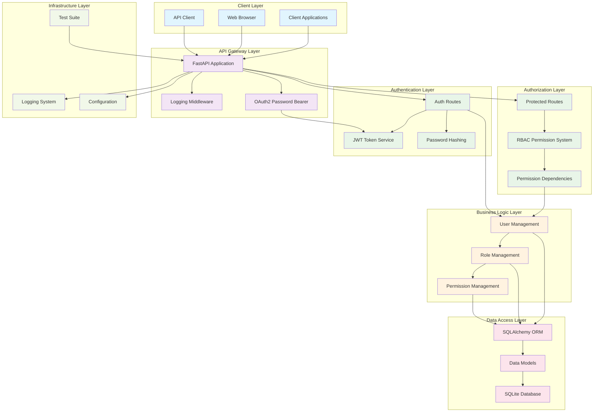
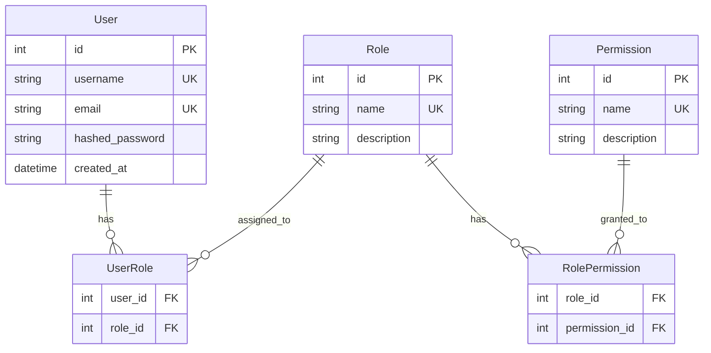
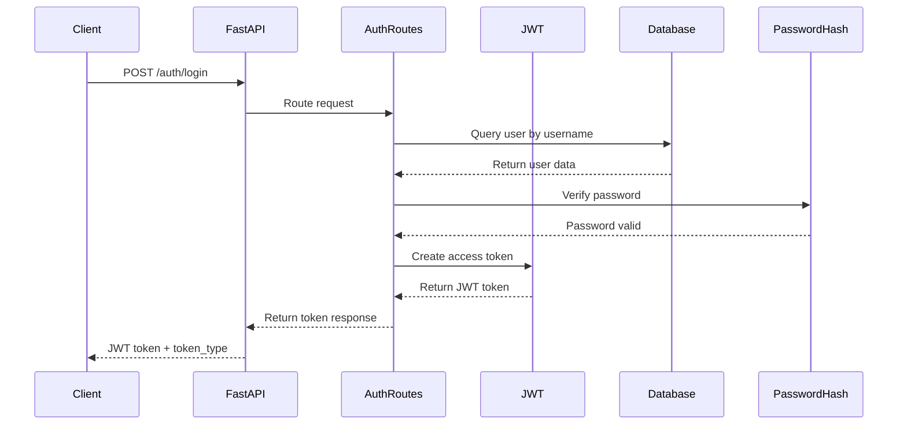
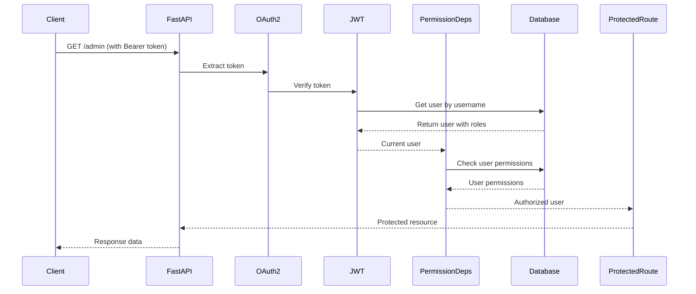

# RBAC Authentication System - Architecture Diagram

## System Overview



## Detailed Component Architecture

### 1. Data Model Relationships



### 2. Authentication Flow



### 3. Authorization Flow



### 4. Application Structure

```
rbac-auth-system/
├── app/
│   ├── main.py                 # FastAPI application entry point
│   ├── database.py             # Database initialization & seeding
│   │
│   ├── models/                 # SQLAlchemy Data Models
��   │   ├── base.py            # Base model & database session
│   │   ├── user.py            # User model with RBAC methods
│   │   ├── role.py            # Role model
│   │   ├── permission.py      # Permission model
│   │   └── associations.py    # Many-to-many relationship tables
│   │
│   ├── auth/                   # Authentication Components
│   │   ├── jwt.py             # JWT token creation & verification
│   │   └── password.py        # Password hashing utilities
│   │
│   ├── permissions/            # Authorization Components
│   │   └── dependencies.py    # Permission checking dependencies
│   │
│   ├── routes/                 # API Endpoints
│   │   ├── auth.py            # Authentication routes (/auth/*)
│   │   └── protected.py       # Protected routes (/admin, /edit, /view)
│   │
│   └── logging/                # Logging Infrastructure
│       ├── config.py          # Logging configuration
│       └── middleware.py      # Request/response logging middleware
│
├── tests/                      # Test Suite
│   ├── conftest.py            # Test configuration & fixtures
│   ├── test_auth.py           # Authentication tests
│   └── test_rbac.py           # RBAC functionality tests
│
├── alembic/                    # Database Migration Tool
├── requirements.txt            # Python dependencies
└── README.md                   # Project documentation
```

## Key Features & Components

### Core Technologies
- **FastAPI**: Modern, fast web framework for building APIs
- **SQLAlchemy**: Python SQL toolkit and ORM
- **SQLite**: Lightweight database for development
- **JWT**: JSON Web Tokens for stateless authentication
- **Passlib**: Password hashing library with bcrypt
- **Pydantic**: Data validation using Python type annotations

### Security Features
- **JWT-based Authentication**: Stateless token-based auth
- **Password Hashing**: Secure bcrypt password storage
- **Role-Based Access Control**: Flexible permission system
- **OAuth2 Password Bearer**: Standard OAuth2 implementation

### Default RBAC Setup
- **Permissions**: `can_read`, `can_write`, `can_delete`
- **Roles**:
  - Admin: All permissions
  - Editor: `can_read` + `can_write`
  - Viewer: `can_read` only
- **Protected Endpoints**:
  - `/admin` → requires `can_delete`
  - `/edit` → requires `can_write`
  - `/view` → requires `can_read`

### Known Issues
- **Permission Bug**: Intentional bug in `check_user_permission()` function using incorrect logic (`or` instead of proper permission matching)
- **Test Coverage**: Tests only cover Admin role functionality

## Deployment Considerations

### Development
```bash
uvicorn app.main:app --reload
```

### Production Recommendations
- Use PostgreSQL instead of SQLite
- Set proper JWT secret key via environment variables
- Configure proper logging levels
- Use HTTPS for all communications
- Implement rate limiting
- Add input validation and sanitization
- Set up proper error handling and monitoring